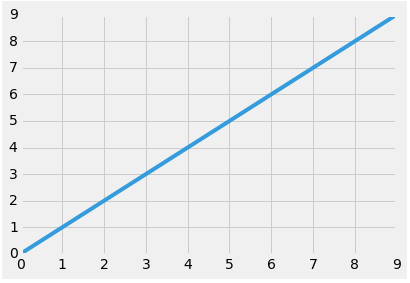

# Read 14 - Class 401

Matplotlib is used for plotting 2D plots using Pyplot which provides a convenient interface to the matplotlib object oriented plotting library. Plots usually look like those in Matlab. With Matplotlib we have the ability to customize all kinds of properties of a plot like the dpi, and the figure size.

In this read, I am not going to explain things as I know them since there is not a lot to explain, and a good thing is to include just a simple plot with the instructions or the steps on how to do it.

```python
%matplotlib inline

import numpy as np
import matplotlib.pyplot as plt

```

```python
x = np.arange(0,10)
y = np.arange(0,10)
```

```python
plt.plot(x,y)
```


```python
plt.style.use('fivethirtyeight')
plt.plot(x,y)
```


```python
x = np.arange(-10,10)
a = np.arange(0,20)
b = [b**2 for b in range(0,20)]
c = [100 for c in range(0,20)]

plt.title("Some Squiggles")
plt.plot(x,a, label='linear')
plt.plot(x,b, label='exponential')
plt.plot(x,c, label='flat')
plt.legend(loc='upper left', frameon=True)
plt.ylabel('The Y Label')
plt.xlabel('The X Label')
```

